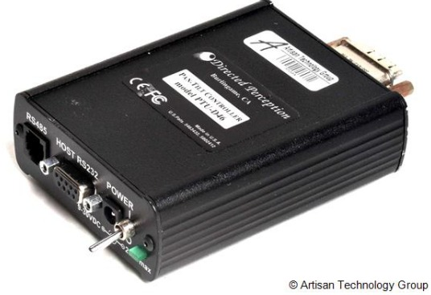
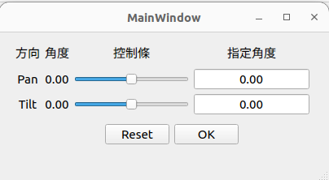

# pan_tilt_platform  

 

  

Get limits of ptu46...  
The limits of  pan position:  ['-3073', '3073']  
The limits of tilt position:  ['-899', '593']  

Directed Perception  
PAN-TILT UNIT: model [PTU-46-17.5](https://www.flir.com/products/ptu-e46/?vertical=mcs&segment=oem)  
PAN-TILT CONTROLLER: model [PTU-D46E](https://www.artisantg.com/PLC/72424-1/FLIR-Systems-Directed-Perception-PTU-D46-Computer-Controlled-Pan-Tilt-Unit)  

[User Manual](https://movitherm.com/wp-content/uploads/2018/07/ptu-e46-user-manual.pdf)  
[Command Reference Manual](https://movitherm.com/wp-content/uploads/2017/01/E-Series-Command-Reference-Manual.pdf)   

## Execution
git clone https://github.com/uptopia/pan_tilt_platform.git

sudo pip3 install pyserial  
sudo dmesg | grep tty  
sudo chmod 777 /dev/ttyUSB0  

### Method1: pan_tilt_ui

   

`python3 ui2.py`  

1. press reset  
2. type values + press ENTER  
3. press OK  

### Method2: via terminal
`echo {cmd} >> /dev/ttyUSB0`

cmd =  
    **r**      Perform Reset calibration  
    **pp**     Query current absolute pan position  
    **pp100**    Set desired absolute pan position  
    **tp**       Query current absolute tilt position  
    **tp100**    Set desired absolute tilt position  
    **px** **pn**    Maximum/Minimum Pan position  
    **tx** **tn**    Maximum/Minimum Tilt position  

ref:  
https://github.com/antoinebou12/Pan-Tilt-Controller  
